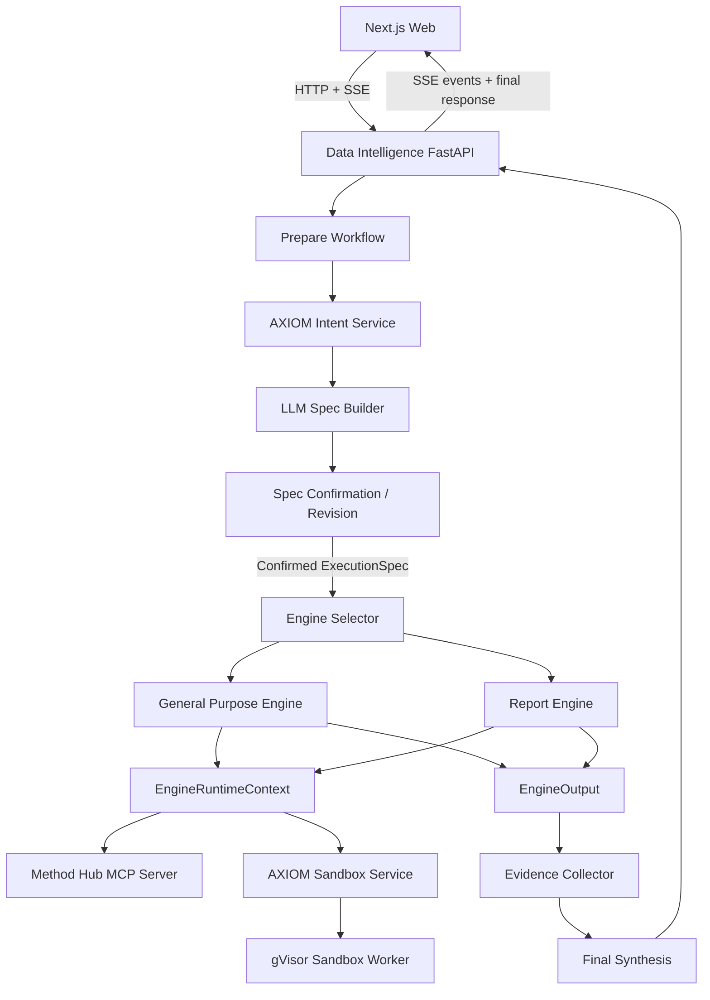

# Kiến trúc hiện tại của Data Intelligence System

Tài liệu này mô tả kiến trúc đang được triển khai trong `Data-Intelligence-SDK`
và các dịch vụ AXIOM liên quan. Tài liệu đồng thời phân biệt giữa:

- Vai trò kiến trúc mong muốn của từng thành phần.
- Implementation hiện tại đã đáp ứng đến đâu.
- Những khoảng cách cần tiếp tục điều chỉnh.

## 1. Nguyên tắc điều phối chính

Thứ tự quyết định của hệ thống là:

```text
User Query + Data Context
    -> Intent Analysis
    -> Related Intents + Common Processing Steps
    -> ExecutionSpec
    -> User Confirmation
    -> Engine Selection
    -> Runtime Provisioning
    -> Engine Execution
    -> Evidence + Final Response
```

Intent Analysis không trực tiếp chọn engine. Engine chỉ được chọn sau khi hệ
thống đã xây dựng và xác nhận `ExecutionSpec`.

## 2. Sơ đồ hệ thống tổng quát



## 3. Các deployable chính

| Thành phần            | Vai trò                                                               |
| --------------------- | --------------------------------------------------------------------- |
| Next.js Web           | Giao diện query, upload, confirmation, revision và report preview     |
| Data Intelligence API | HTTP/SSE transport, workflow orchestration và run persistence         |
| Data Intelligence SDK | Spec pipeline, engine selection, runtime contracts và engines         |
| Intent Service        | Phân tích intent liên quan và cung cấp processing knowledge           |
| Method Hub            | Cung cấp governed tools qua MCP                                       |
| Sandbox Service       | Quản lý sandbox lifecycle, files, commands và dependency provisioning |
| Sandbox Worker        | Thực thi Python cô lập bằng gVisor                                    |
| PostgreSQL            | Lưu response runs, revisions và trạng thái của các control plane      |
| Artifact Store        | Lưu code attempts, execution artifacts, reports và event manifests    |

## 4. Web layer

Frontend hiện nằm trong `web/`.

Trách nhiệm chính:

- Nhận query của người dùng.
- Upload hoặc chọn data source.
- Gửi request tạo response.
- Nhận draft `ExecutionSpec`.
- Hiển thị confirmation và revision UI.
- Gửi quyết định confirm hoặc revise.
- Nhận progress qua Server-Sent Events.
- Hiển thị kết quả General hoặc Report Engine.
- Bật hoặc tắt Method Hub theo runtime option.

Frontend không trực tiếp gọi Intent Service, Method Hub hoặc Sandbox Service.
Các service này được truy cập thông qua Data Intelligence API và SDK runtime.

## 5. Data Intelligence API

FastAPI application gồm các router chính:

| Router                 | Trách nhiệm                                          |
| ---------------------- | ---------------------------------------------------- |
| `health`               | Kiểm tra API và run repository                       |
| `uploads`              | Quản lý data corpus files                            |
| `runtime-capabilities` | Hiện chỉ kiểm tra Method Hub availability            |
| `responses`            | Prepare, confirm, revise, execute và stream workflow |

Responses API sử dụng background thread và queue trong process để chuyển các
operation đồng bộ của SDK thành SSE events.

```text
FastAPI request
    -> background Thread
    -> workflow operation
    -> Queue messages
    -> SSE stream
    -> Web client
```

Đây chưa phải distributed worker architecture. Nếu API process dừng, operation
đang chạy trong thread cũng không còn độc lập.

## 6. Workflow lifecycle

### 6.1 Request mapping

API chuyển request thành các SDK contract:

```python
WorkflowInvocation(
    query=UserQuery(...),
    corpus_package=DataCorpusPackage(...),
    session_context=SessionContext(...),
    user_context=UserContext(...),
    runtime_options=WorkflowRuntimeOptions(...),
)
```

Trong bước này hệ thống:

- Chuẩn hóa query.
- Dùng default query nếu input rỗng.
- Resolve source paths.
- Chặn source nằm ngoài `DATA_CORPUS_ROOT`.
- Resolve request-scoped Method Hub option.

### 6.2 Spec preparation

```text
UserQuery + DataCorpusPackage
    -> Intent Analysis
    -> Spec Build Context
    -> LLM Spec Builder
    -> Draft ExecutionSpec
    -> Persist revision
    -> response.requires_confirmation
```

Giai đoạn này chưa chọn engine và chưa provision sandbox.

### 6.3 Confirmation và revision

```text
Draft ExecutionSpec
    -> Confirm
        -> mark confirmed
        -> begin execution

    -> Revise
        -> user feedback / structured edit
        -> rebuild spec
        -> persist new revision
        -> require confirmation again
```

Confirmation là boundary bắt buộc trước engine selection.

### 6.4 Confirmed execution

```text
Confirmed ExecutionSpec
    -> Engine Selector
    -> Sandbox provisioning
    -> EngineRuntimeContext
    -> Selected Engine
    -> EngineOutput
    -> Evidence collection
    -> Final synthesis
```

## 7. Intent Analysis

### 7.1 Vai trò kiến trúc đúng

Intent Service có trách nhiệm hiểu query ở mức bài toán, không chỉ gán query
vào một engine type.

Luồng semantic mong muốn:

```text
User Query
    -> xác định primary intent
    -> xác định các related / secondary intents
    -> truy xuất governed intent definitions
    -> lấy processing steps phổ biến của các intent liên quan
    -> tổng hợp intent context cho Spec Builder
```

Ví dụ, query:

```text
Phân tích doanh thu theo tháng, tìm tháng bất thường và tạo báo cáo.
```

Có thể liên quan đến:

```text
Primary intent:
    comparative_analysis

Related intents:
    aggregate_data
    anomaly_detection
    data_visualization

Common processing steps:
    inspect schema
    identify date and revenue fields
    aggregate revenue by month
    detect anomalous periods
    prepare chart-ready evidence
    generate structured report
```

Kết quả Intent Analysis phải trở thành planning context cho Spec Builder. Intent
Service không cần tạo `ExecutionSpec` hoàn chỉnh và không chọn engine.

### 7.2 Quan hệ với Spec Builder

```text
Intent Service output
    + User Query
    + DataCorpusPackage
    + Session/User Context
    + Selected Data Context
        -> Spec Builder
        -> ExecutionSpec
```

Spec Builder chuyển intent knowledge thành contract thực thi cụ thể:

- `objective`
- `data_requirements`
- `capability_requirements`
- `constraints`
- `engine_hint`

Intent processing steps là gợi ý có governance. Spec Builder vẫn phải kiểm tra
chúng với data source, schema và scope thực tế của request.

### 7.3 Quan hệ với Engine Selector

Engine Selector không nhận raw query để thay Intent Service quyết định cách giải
quyết bài toán.

Engine Selector nhận `ExecutionSpec` đã được xây dựng và xác nhận:

```text
Confirmed ExecutionSpec
    -> compare spec requirements with engine catalog
    -> select General Purpose Engine hoặc Report Engine
```

Như vậy thứ tự đúng là:

```text
Intent knowledge
    -> ExecutionSpec
    -> Confirmation
    -> Engine selection
```

Không phải:

```text
Intent classification
    -> chọn engine ngay
    -> engine tự suy ra phần còn lại
```

### 7.4 Implementation hiện tại

Intent Service hiện đã có các khái niệm:

- Primary intent.
- Secondary intents.
- Governed intent definitions.
- `processing_steps` trên intent definition.
- Semantic/hybrid intent search.

Tuy nhiên adapter hiện tại của Data Intelligence mới:

1. Gọi `/api/v1/intent-search` với `limit=1`.
2. Chỉ lấy top catalog intent.
3. Map catalog intent xuống một normalized intent thô:

```text
reason | report | general | unknown
```

4. Giữ catalog intent id, score và `processing_steps` của top intent trong
   `IntentAnalysis`.
5. Đưa `IntentAnalysis.processing_steps` vào `SpecBuildContext` để hướng dẫn
   Spec Builder xây dựng objective, capability requirements và constraints.
6. Chưa truyền related intents vào Spec Builder.

Vì vậy implementation hiện tại chưa thực hiện đầy đủ vai trò kiến trúc đã mô tả
ở trên.

### 7.5 Hướng điều chỉnh Intent contract

`IntentAnalysis` nên có khả năng biểu diễn ít nhất:

```json
{
  "primary_intent": {},
  "related_intents": [],
  "processing_steps": {},
  "confidence": 0.0,
  "source": "axiom_intent_service"
}
```

Tên field cuối cùng cần bám theo governed Intent Service schema, tránh tạo một
schema song song chỉ tồn tại trong SDK.

Spec Build Context sau đó nên chứa intent analysis đầy đủ thay vì chỉ một string
normalized intent.

## 8. Spec Builder

Spec Builder nhận task-local context và tạo `ExecutionSpec` draft.

```json
{
  "objective": "string",
  "data_requirements": ["source-ref"],
  "capability_requirements": [
    {
      "name": "capability-name",
      "description": "...",
      "input_schema": {},
      "output_schema": {},
      "constraints": {},
      "metadata": {}
    }
  ],
  "constraints": {},
  "engine_hint": null
}
```

Spec Builder chịu trách nhiệm:

- Chuyển query và intent context thành objective có thể thực thi.
- Chọn data requirements trong source boundary.
- Biểu diễn processing needs thành capability requirements.
- Gắn filters, metrics, group-by, output format và scope.
- Không gọi tool hoặc thực thi query.

## 9. Engine selection

Engine Registry hiện đăng ký các engine và có thể dùng LLM Engine Selector.

```text
Confirmed ExecutionSpec
    -> Engine catalog
    -> selector
    -> selected engine
    -> fallback engine nếu selector lỗi hoặc trả tên không tồn tại
```

Hai engine chính hiện tại:

- `GeneralPurposeEngine`
- `ReportEngine`

Intent có thể ảnh hưởng đến spec, nhưng engine selection phải dựa trên toàn bộ
spec contract, không chỉ một intent label.

## 10. Shared engine runtime

Mỗi confirmed execution nhận một request-scoped `EngineRuntimeContext`:

```python
EngineRuntimeContext(
    run_context=...,
    mcp_client=...,
    mcp_tools=...,
    interface_registry=...,
    interface_builder=...,
    sandbox_executor=...,
    artifact_store=...,
    log_store=...,
    resource_manager=...,
    sandbox=...,
    run_artifact=...,
)
```

Runtime là dependency container dùng chung cho các engine. Nó không phải global
singleton; pipeline tạo runtime theo từng request execution.

## 11. Shared sandbox

`EngineSandboxSession` là sandbox contract dùng chung:

```text
EngineSandboxSession
    -> source path mapping
    -> environment metadata
    -> Python execution
    -> execution artifacts
    -> sandbox method-call observations
```

Engine-specific adapter:

```text
EngineSandboxSession
├── General Purpose Engine
│   └── DeepAgentSandboxBackend
└── Report Engine
    └── RequestSandboxExecutor
```

Generic sandbox không phụ thuộc trực tiếp vào Deep Agents.

## 12. General Purpose Engine

General Engine dùng một Deep Agent với:

- Native Method Hub MCP tools.
- `execute_python` sandbox tool.
- Staged source paths.
- Deep Agent filesystem backend.

Engine này phù hợp với exploratory analysis, general reasoning và các task không
cần structured report workflow.

## 13. Report Engine

Report Engine dùng LangGraph multi-agent workflow:

```text
Plan
    -> Template negotiation
    -> Data-step scheduling
    -> Route existing MCP tool hoặc generate Python
    -> Sandbox validation
    -> Data analysis
    -> Chart preparation
    -> Report composition
    -> HTML/Markdown rendering
```

Report Engine nhận `ExecutionSpec` đã được xác nhận. Nó không nên tự diễn giải
lại raw query theo một intent system riêng.

## 14. Method Hub

Method Hub cung cấp governed tools qua MCP.

Direct tool flow:

```text
Engine
    -> runtime.mcp_tools
    -> MCPMethodClient
    -> Method Hub MCP server
```

Generated-code composition:

```text
Generated Python
    -> axiom_method_hub.call_tool()
    -> sandbox MCP broker
    -> Method Hub MCP server
```

Tool names, parameter schemas và capabilities nên đến từ MCP discovery, không
nên được hardcode trong engine.

## 15. Sandbox Service

Sandbox Service gồm hai phần:

```text
Sandbox API
├── lifecycle control plane
├── command queue
├── file API
├── logs
└── PostgreSQL state

Sandbox Worker
├── operation polling
├── gVisor sandbox lifecycle
├── isolated Python execution
├── approved dependency provisioning
└── command status updates
```

Sandbox API healthy không đảm bảo execution runtime healthy. Worker phải online
và heartbeat thành công.

## 16. Persistence

Hệ thống có hai persistence planes:

| Plane          | Dữ liệu                                                        |
| -------------- | -------------------------------------------------------------- |
| Run Repository | Response state, spec revisions, confirmation, output và errors |
| Artifact Store | Code attempts, execution results, reports và event manifests   |

Run Repository production dùng PostgreSQL. Artifact Store hiện chủ yếu dùng
filesystem-backed run directory.

## 17. Observability

Các kênh observability hiện có:

- SSE pipeline events.
- Runtime logger.
- Per-run artifact events.
- Engine step traces.
- Method Hub call traces.
- LangSmith LLM traces.
- Sandbox command logs.

## 18. Khoảng cách kiến trúc hiện tại

### Intent flow

- Adapter hiện chỉ lấy một catalog intent, phù hợp với phạm vi triển khai trước
  mắt.
- Related intents chưa được chuyển sang SDK.
- `processing_steps` của intent đã được đưa vào Spec Build Context làm governed
  planning guidance.
- Normalized intent hiện vẫn quá gần một coarse engine category.

### Spec Builder

- Một số deterministic fields vẫn phụ thuộc hoàn toàn vào LLM output.
- Validation retry chưa luôn có deterministic fallback phù hợp.

### Runtime capability discovery

- `/runtime-capabilities` hiện chỉ trả Method Hub state.
- Chưa expose Sandbox Service/worker readiness.

### Engine layer

- Report Engine vẫn là module lớn, chứa prompts, routing, graph, policy và renderer.
- Một số Router fallback vẫn biết concrete Method Hub tool names.

### Local sandbox

- Dockerized gVisor worker không ổn định trên Docker Desktop.
- Control-plane health và execution-runtime health chưa được phân biệt rõ ở UI.

## 19. Hướng ưu tiên tiếp theo

1. Mở rộng Intent Analysis contract để mang related intents và processing steps.
2. Đưa intent analysis đầy đủ vào `SpecBuildContext`.
3. Xây dựng `ExecutionSpec` từ query + governed intent knowledge + data context.
4. Giữ engine selection hoàn toàn sau spec confirmation.
5. Expose sandbox worker readiness qua runtime capabilities.
6. Tách Report Engine policies và renderer khỏi orchestration graph.
