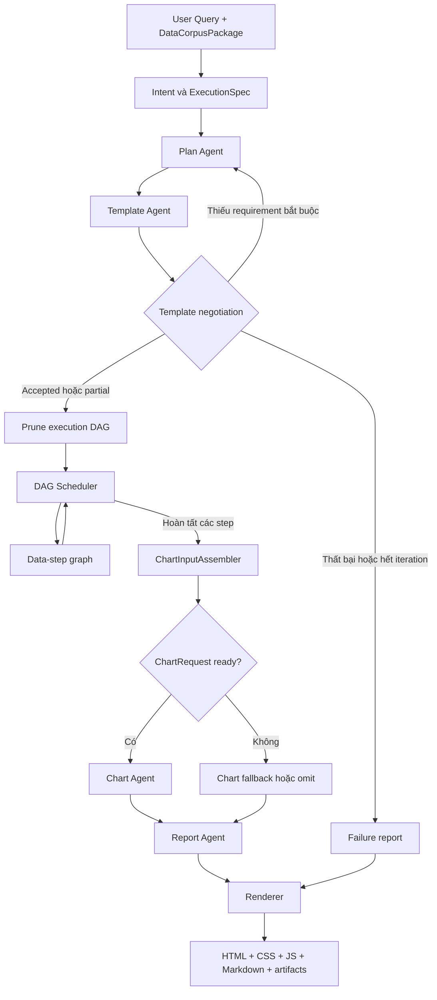
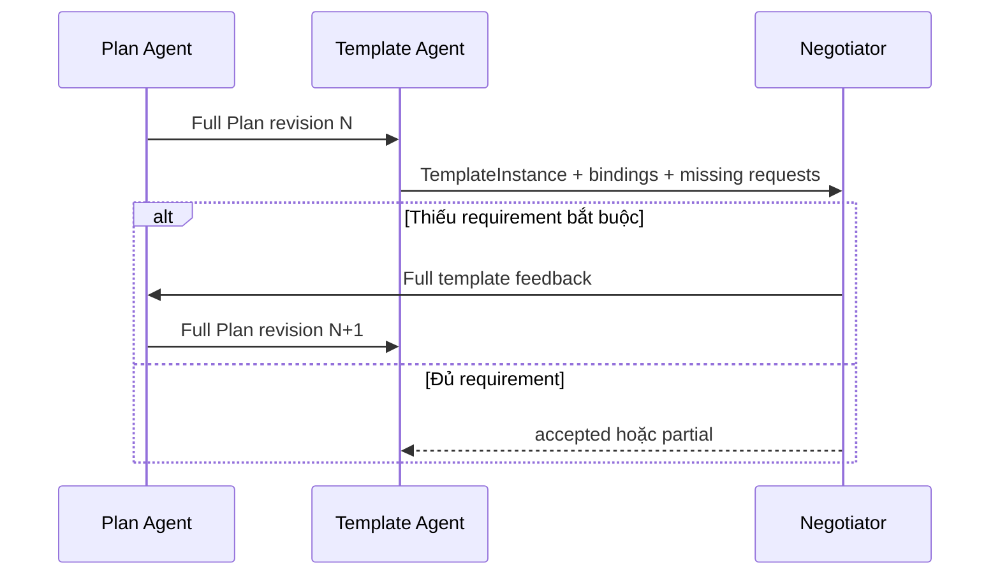
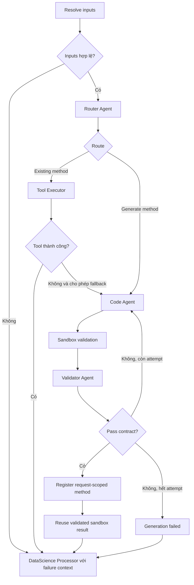

# Report Engine V2 - Luồng hiện tại

Tài liệu này mô tả implementation đang chạy trong
`packages/sdk/src/data_intelligence_sdk/engines/report.py`. Đây là tài liệu
hiện trạng, khác với `report-engine-v2-implementation-plan.md`, vốn là bản kế
hoạch thiết kế ban đầu.

## 1. Mục tiêu

Report Engine nhận:

- `UserQuery`: câu hỏi hoặc yêu cầu tạo báo cáo.
- `ExecutionSpec`: objective, scope, capability và output format đã được xác nhận.
- `DataCorpusPackage`: danh sách source, schema và metadata được phép sử dụng.
- `EngineRuntimeContext`: Method Hub, sandbox, artifact store, interface registry
  và run context của request hiện tại.

Engine trả:

- Báo cáo có cấu trúc dạng JSON.
- Markdown.
- HTML độc lập.
- CSS.
- JavaScript khởi tạo ECharts.
- Artifact bundle và execution trace của toàn bộ run.

## 2. Sơ đồ tổng quát



Report Engine dùng LangGraph để biểu diễn graph chính và một subgraph riêng cho
từng data step.

## 3. Plan Agent

### Input

```json
{
  "execution_spec": {},
  "corpus_package": {},
  "previous_plan": null,
  "template_feedback": []
}
```

### Trách nhiệm

- Chuyển objective thành DAG dữ liệu.
- Mỗi step có `step_id`, `inputs`, `depends_on`, `operation` và `outputs`.
- Không tự sinh HTML, Markdown hoặc ECharts option.
- Chỉ dùng source, table, collection và column nằm trong scope.
- Với file local, tạo bước materialize source thành JSON record có cấu trúc tự
  nhiên như table rows, document pages hoặc text chunks.
- Gắn semantic role như `goal_evidence` để Template Agent có thể bind.

### Output rút gọn

```json
{
  "plan_id": "report-plan",
  "revision": 1,
  "steps": [
    {
      "step_id": "extract-text",
      "depends_on": [],
      "inputs": [],
      "operation": {"kind": "read_source_content"},
      "outputs": [
        {
          "name": "document-pages",
          "shape": "table",
          "semantic_roles": ["source_content", "goal_evidence"]
        }
      ]
    }
  ]
}
```

## 4. Vòng lặp Plan - Template



Quy tắc hiện tại:

- Mỗi vòng truyền lại toàn bộ Plan và toàn bộ TemplateInstance.
- Chỉ requirement bắt buộc mới buộc Plan phải revision.
- Requirement optional có thể dùng fallback mà không làm report thành partial.
- Số vòng mặc định tối đa là 3.
- Negotiation dừng nếu revision hash không thay đổi, requirement bắt buộc bị
  reject hoặc đạt iteration limit.

Template file hiện dùng cho file report:

- `document-analysis.json`: PDF, TXT, Markdown và document chunks.
- `data-profile.json`: CSV, TSV, spreadsheet, Parquet và tabular JSON.

Hai template dùng `goal-evidence` làm nguồn cho:

- Nội dung report.
- Bốn overview metric động.
- Chart dataset.

## 5. Prune execution DAG

Sau khi template accepted, engine không chạy mù toàn bộ step mà LLM đã đề xuất.

```text
Template bindings
  -> tìm các plan output đang có consumer
  -> lấy step tạo ra các output đó
  -> đi ngược toàn bộ dependency tổ tiên
  -> chỉ giữ tập step này để scheduler chạy
```

Ví dụ:

```text
load-file -> extract-text -> summarize-for-report
                  |
                  +------ template bind goal-evidence
```

Nếu template bind output của `extract-text`, execution plan giữ:

```text
load-file -> extract-text
```

`summarize-for-report` bị bỏ vì Report Agent đã chịu trách nhiệm tổng hợp nội
dung. Cách này giảm số lần gọi LLM, code generation và sandbox không cần thiết.

## 6. DAG Scheduler

Scheduler chạy theo từng wave:

```text
Wave 1: step-a, step-b, step-c
Wave 2: step-d phụ thuộc a, step-e phụ thuộc b + c
Wave 3: step-f phụ thuộc d + e
```

Các step cùng wave được dispatch song song bằng LangGraph `Send`. Số data step
chạy đồng thời vẫn bị giới hạn bởi semaphore của Report Engine.

Scheduler:

- Chỉ đưa step vào `ready` khi mọi dependency đã completed.
- Skip step nếu dependency bắt buộc failed hoặc skipped.
- Dependency optional bị lỗi không nhất thiết chặn downstream.
- Phát hiện dependency cycle hoặc dependency không resolve được.
- Sau mỗi wave quay lại scheduler để tính wave tiếp theo.

Scheduler không quyết định dùng tool hay code. Quyết định đó thuộc Router Agent
trong data-step graph.

## 7. Data-step graph



### 7.1 Input Resolver

Input Resolver:

- Resolve `step-output://step-id/output-name`.
- Lấy JSON value, artifact reference, schema và sandbox path.
- Merge dữ liệu upstream vào arguments của tool hoặc generated function.
- Fail sớm nếu input bắt buộc không tồn tại.

### 7.2 Router Agent

Router nhận:

```json
{
  "step_request": {},
  "method_hub": [],
  "allowed_sources": []
}
```

Router trả một trong hai route:

```json
{
  "route": "existing_tool",
  "tool_name": "extract_pdf_text",
  "arguments": {}
}
```

hoặc:

```json
{
  "route": "generate_tool",
  "tool_name": null,
  "arguments": {}
}
```

Khi `REPORT_FORCE_CODE_AGENT=true`, Router bị bypass và mọi data step đi qua
Code Agent. Đặt `false` để dùng routing bình thường.

### 7.3 Existing method

Tool Executor gọi method đã đăng ký trong Method Hub. Nếu method lỗi và
`fallback_to_generation_on_tool_error=true`, data step chuyển sang Code Agent.

### 7.4 Code generation loop

Code Agent sinh:

```json
{
  "tool_name": "extract_document_content",
  "source_code": "def extract_document_content(path: str): ...",
  "parameters_schema": {},
  "output_schema": {},
  "execution_arguments": {}
}
```

Mỗi attempt thực hiện:

1. Chuẩn hóa function signature, parameter schema và execution arguments.
2. Chạy function trong sandbox network-disabled.
3. Kiểm tra Python syntax và runtime status.
4. Kiểm tra output schema và shape.
5. Validator Agent trả `Pass`, `Fail` hoặc `NeedsRevision`.
6. Nếu chưa pass, gửi error log và validation feedback về Code Agent.

Mặc định tối đa 4 attempt.

Generated function không chạy lại lần thứ hai sau validation. Khi validation
pass, engine:

- Đăng ký interface và method vào registry/Method Hub của request hiện tại.
- Đánh dấu trust level `generated_validated`.
- Tái sử dụng chính kết quả sandbox đã validated.

Method generated hiện là request-scoped, chưa được persist thành method dùng
lâu dài cho run khác.

## 8. DataScience Processor

DataScience Processor nhận raw execution result và tạo DataStepResult chuẩn hóa.

### Xử lý deterministic

- Persist output artifact.
- Infer schema.
- Profile row count, null, cardinality và numeric stats.
- Tạo stratified bounded sample.
- Thêm lineage và source context.
- Chuẩn hóa metric và chart dataset.

### Output nội dung

```json
{
  "step_id": "extract-text",
  "status": "completed",
  "analysis_summary": "A concise report-facing summary.",
  "report_content": {
    "executive_summary": "Four to six sentences.",
    "key_findings": [
      {
        "title": "Finding title",
        "statement": "Specific finding.",
        "evidence_refs": ["page 10"]
      }
    ],
    "supporting_evidence": [
      {
        "statement": "Evidence statement.",
        "source_location": "page 10"
      }
    ],
    "implications": [
      {
        "title": "Why it matters",
        "statement": "Practical implication."
      }
    ],
    "limitations": ["A real evidence limitation."]
  },
  "aggregated_metrics": [],
  "chart_datasets": [],
  "warnings": []
}
```

Các block report không còn cùng đọc một `analysis_summary`. Mỗi block lấy một
trường riêng nên giảm lặp:

| Block | Nguồn nội dung |
| --- | --- |
| Executive Summary | `executive_summary` |
| Key Findings | `key_findings` |
| Supporting Evidence | `supporting_evidence` |
| Interpretation | `implications` |
| Limitations | `limitations` |

### Overview metrics

Processor hiển thị tối đa bốn metric theo thứ tự:

1. Metric có ý nghĩa do Data Science Agent chọn.
2. Nếu chưa đủ bốn, bổ sung metric cấu trúc tổng quát như record, field, word
   hoặc character count.

Tên metric không bị cố định theo PDF. Tuy nhiên policy "bốn ô" và fallback
metric là hardcode ở tầng presentation contract.

### Chart dataset

Data Science Agent có thể trả:

```json
{
  "chart_data": {
    "title": "Concept frequency",
    "coverage": "12 sampled document units",
    "rows": [
      {"category": "Modularity", "value": 7},
      {"category": "Cohesion", "value": 5}
    ]
  }
}
```

Nếu LLM không tạo chart data hợp lệ, processor thử fallback tổng quát:

- Ordered numeric series.
- Category + numeric aggregation.
- Category frequency.
- Text term frequency.

## 9. ChartInputAssembler và Chart Agent

ChartInputAssembler không phải LLM agent. Đây là lớp deterministic để:

- Đọc chart slot từ TemplateInstance.
- Resolve requirement binding sang plan output.
- Tìm chart dataset trong DataStepResult.
- Gộp nhiều dataset nếu một chart dùng nhiều step.
- Tạo ChartRequest chuẩn.

Chart chỉ `ready` khi:

- Mọi requirement của chart đã bind.
- Mọi output reference cần thiết tồn tại.
- Có ít nhất một dataset.
- `dataset.data` không rỗng.

Nếu không đủ, assembler trả `insufficient_data` và renderer dùng fallback hoặc
omit chart.

Lưu ý: điều kiện hiện tại kiểm tra "đủ cấu trúc để vẽ", chưa có quality score để
đảm bảo chart luôn có insight mạnh. Dataset có nhiều category nhưng tất cả value
bằng nhau vẫn có thể pass. Hướng cải thiện tiếp theo là thêm:

```json
{
  "should_render": true,
  "quality_score": 0.82,
  "objective_relevance": 0.9,
  "reason": "The comparison has meaningful variance."
}
```

Chart Agent chuyển ChartRequest thành ECharts option và chỉ dùng field có trong
dataset schema. Option được polish deterministic để sửa margin, màu, tooltip,
label density và xoay category label dài.

## 10. Report Agent

Report Agent nhận:

- TemplateInstance.
- DataStepResults.
- ChartResults.
- User objective.
- Source scope.

Report Agent tạo Structured Report JSON nhưng phải giữ nguyên:

- Thứ tự section và block của template.
- Block type.
- Chart ID và metric evidence.
- Required/optional status.

Fallback deterministic vẫn tạo được report nếu LLM synthesis không trả JSON hợp
lệ. Warning chỉ lấy từ step thực sự được template bind; warning từ step
`completed_no_data` không được đẩy bừa vào báo cáo.

## 11. Renderer

Renderer tạo bốn output:

```text
report.md
report.css
report.js
report.html
```

Renderer dùng block type:

| Block type | HTML |
| --- | --- |
| `narrative` | Paragraph |
| `recommendations` | Scan-friendly bullet list |
| `kpi_group` | Responsive KPI grid |
| `chart` | ECharts container + JSON option |
| `table` | Responsive table |

### Phần hardcode

- Color palette.
- Font, spacing và border.
- Grid 12 cột.
- Breakpoint 900px và 640px.
- KPI tối đa bốn ô.
- Chart minimum height.
- Cách render từng block type.
- ECharts CDN URL.

### Phần dynamic

- Tên và thứ tự section.
- Block xuất hiện hay bị omit.
- Layout span của block.
- Nội dung narrative/finding/evidence.
- Tên và giá trị KPI.
- Chart title, type, category, measure và option.
- Warning, source và report status.

Renderer đẹp hơn bản cũ vì không còn bọc một chuỗi Markdown thành wall of text.
Template cung cấp composition 12 cột, còn CSS cung cấp visual system nhất quán.

## 12. Artifact và trace

Mỗi request tạo:

```text
artifacts/<run-id>/
  manifest.json
  events.jsonl
  code/
    attempt-001.py
  executions/
    attempt-001.json
  data/
    <step-id>/
  rendered/
    report.md
    report.css
    report.js
    report.html
```

Sandbox container bị xóa sau request, nhưng artifact bundle được giữ để debug.
`artifacts/`, `.uploads/` và logs local đã nằm trong `.gitignore`.

## 13. Các thay đổi chính so với luồng cũ

1. Report Engine dùng LangGraph thay cho điều phối hoàn toàn thủ công.
2. Plan và Template negotiation có revision loop rõ ràng.
3. Execution DAG bị prune theo template consumer trước khi chạy.
4. Scheduler dispatch song song các step cùng wave.
5. Router hỗ trợ existing method và generated method.
6. Code loop có sandbox, output contract, Validator và tối đa 4 attempt.
7. Generated method được đăng ký request-scoped và tái sử dụng validated result.
8. Data Science output tách summary, findings, evidence, implications và limitations.
9. KPI và chart dùng `goal-evidence`, không phụ thuộc output optional mà Plan hay bỏ sót.
10. ChartInputAssembler hỗ trợ chart dùng output từ nhiều step.
11. Report synthesis lọc warning không liên quan và giảm lặp.
12. Renderer tạo dashboard-style HTML, CSS, JS và responsive layout.

## 14. Các file đã thay đổi và vai trò

| File | Thay đổi chính |
| --- | --- |
| `packages/sdk/src/data_intelligence_sdk/engines/report.py` | Hoàn thiện graph Plan/Template, scheduler, Router, code retry loop, DataScience Processor, chart pipeline, report synthesis và renderer HTML/CSS/JS. |
| `packages/api/src/data_intelligence_api/infrastructure/workflow/pipeline_factory.py` | Wire Report Engine vào API, chọn sandbox backend và hỗ trợ `REPORT_FORCE_CODE_AGENT`. |
| `packages/api/src/data_intelligence_api/infrastructure/workflow/docker_sandbox.py` | Tạo request-scoped Docker sandbox với resource limit và network bị tắt. |
| `packages/sdk/src/data_intelligence_sdk/runtime/report_sandbox_executor.py` | Chuẩn hóa generated function, stage input, chạy và đọc kết quả từ sandbox. |
| `packages/sdk/src/data_intelligence_sdk/sandbox/artifacts.py` | Lưu code attempt, execution result, data output và các định dạng report đã render. |
| `packages/sdk/src/data_intelligence_sdk/methods/local_data.py` | Bổ sung method đọc/profile source local để Router có thể dùng khi phù hợp. |
| `packages/sdk/src/data_intelligence_sdk/templates/pool/*.json` | Bổ sung document/data-profile template, binding, KPI và chart requirement. |
| `docker/sandbox.Dockerfile` | Image Python tối thiểu chứa thư viện xử lý dữ liệu phổ biến cho generated code. |
| `web/pages/index.tsx` | Nhận và hiển thị HTML report thay vì chỉ coi final answer là Markdown. |

Flow điều phối không hardcode riêng cho PDF. PDF chỉ là một source type có adapter và
thư viện đọc tương ứng; CSV, spreadsheet, Parquet, JSON và text vẫn đi qua cùng
Plan/Template, Router/Code Agent, DataScience Processor và Renderer. Những phần
phụ thuộc định dạng nằm ở method hoặc generated function, không nằm ở scheduler.

## 15. Giới hạn hiện tại

- Chart gate mới kiểm tra structural validity, chưa chấm analytical usefulness.
- Text chart fallback có stopword heuristic thiên về tiếng Anh.
- Block content role vẫn có phần mapping theo block ID/title.
- Bốn KPI là presentation policy cố định.
- Generated method chỉ tồn tại trong request, chưa có persistent method cache.
- HTML dùng ECharts CDN nên trình duyệt cần truy cập CDN để render chart.
- Docker Compose API hiện chưa được cấu hình để điều khiển Docker sandbox trên
  host; cách local khuyến nghị là chạy API trên host và để API tạo sandbox
  container qua Docker Desktop.
